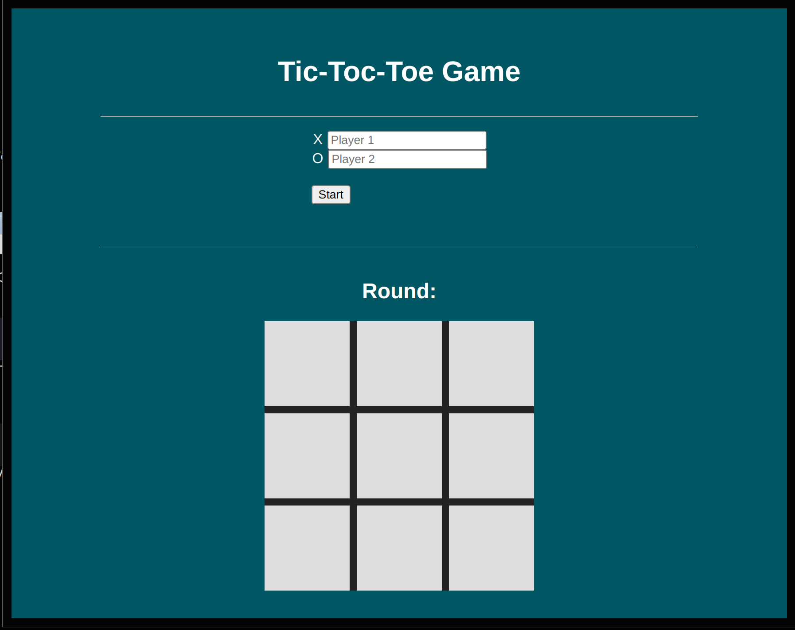

# Tic Tac Toe Game

Welcome to the Tic Tac Toe game repository! This JavaScript project allows you to play the classic Tic Tac Toe game in your web browser. It's a simple and fun two-player game where users take turns to make their moves on a 3x3 grid.

## Features

- **Interactive Web Interface**: Play the game through an easy-to-use web interface.
- **Two-Player Mode**: Challenge a friend and take turns making moves.
- **Win Detection**: The game automatically detects when a player has won or if it's a draw.
- **Responsive Design**: Enjoy the game on different devices and screen sizes.

## How to Play

1. Clone the repository to your local machine:

    ```bash
    git clone hhttps://github.com/matheuspassini/Tic-Toc-Toe-Game.git
    ```

2. Open `index.html` in your preferred web browser.

3. Play the game by clicking choosing the Player Name 1 and 2, on the grid cells to make your moves. The game will alternate between X and O symbols.

4. The game will automatically declare a winner if there is one or announce a draw. To play again, click in the button 'Start'.

## Project Structure

- `index.html`: The HTML file containing the structure of the web page.
- `style.css`: The CSS file for styling the Tic Tac Toe game.
- `index.js`: The JavaScript file containing the game logic.
- `README.md`: This file, providing information about the project.

## Contributions

Contributions are welcome! If you'd like to contribute to the project, please follow these steps:

1. Fork the repository.
2. Create a new branch for your feature or bug fix: `git checkout -b feature-name`.
3. Make your changes and commit them: `git commit -m "Description of changes"`.
4. Push your changes to your fork: `git push origin feature-name`.
5. Open a pull request.

# Board Interface
